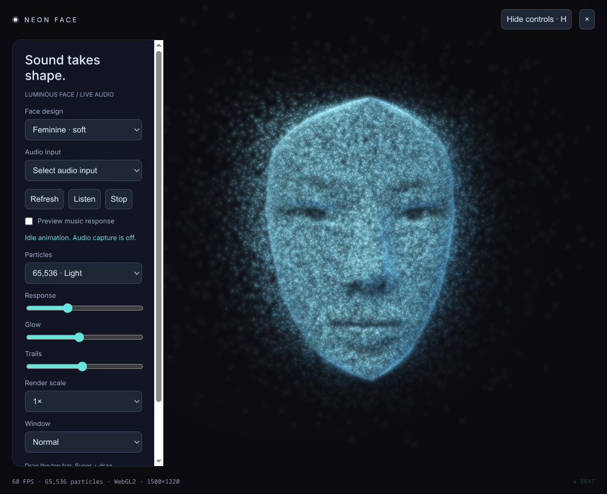

# Neon Face

A standalone audio-reactive cyan particle face derived from [Hector Santos's Neon-Orb](https://github.com/hsantos92/Neon-Orb).



## Run

Requires Linux with PipeWire/PulseAudio, `pactl` and `parec` (provided by `libpulse` on Arch), Node.js 22.12 or newer, and a WebGL2-capable GPU. Desktop validation has been performed on Arch Linux with GNOME Wayland and an NVIDIA GPU.

```sh
git clone git@github.com:hsantos92/Neon-Face.git
cd Neon-Face
npm ci
npm run start:wayland
```

For X11 use `npm run start:x11`. `./launch.sh` is also available for Wayland. If Electron requests its binary setup after installation, run `npm run setup`.

Choose a SYSTEM monitor matching your sound output and click Listen to react to playing music. A microphone can also be selected. Capture starts off. Stop ends capture. “Preview music response” drives the real FFT pipeline with simulated bass pulses without capturing audio; live capture automatically disables the preview. H hides controls, Escape restores them, and Space pauses animation.

## Blender design

Both feminine options now use a new portrait surface based on the supplied reference photograph. The cheeks, jaw, eye openings, nose and fuller lips were rebuilt; sampled reference luminance helps preserve recognizable features in the cyan dots. This is a stylized frontal relief, not a full 3D reconstruction from one image. Soft and Defined vary facial relief strength. The editable study and packed reference are in `assets/neon-face-reference.blend`. Earlier assets are preserved under `versions/pre-reference/`. These version folders contain development snapshots, not independent runnable apps.

## Visual

A cyan particle face with two layers. A fixed layer of surface dots preserves the face shape. The animated dots have 97.5% less motion across the center of the face, with progressively more movement around the temples, sides and rear. Bass and beats move the outer cloud; the head no longer scales as a whole, and particles no longer extrude along surface normals around the nose or eyes. The viewing angle stays fixed so the underlying dots remain stationary.

The original second particle version is preserved in `versions/particle-v2/`; the later mask experiment is preserved in `versions/mask/`.

## Attribution

The active Soft and Defined designs use a stylized portrait surface and luminance sampled from a user-supplied reference photograph. The photograph is packed into the editable Blender study; no separate redistribution license has been established for that image.

Earlier scan-based designs and their attribution are retained for provenance.

Head geometry: **Infinite, 3D Head Scan by Lee Perry-Smith**, CC BY 3.0, based on www.triplegangers.com, distributed through the [Three.js examples](https://github.com/mrdoob/three.js/tree/dev/examples/models/gltf/LeePerrySmith). Original license is in `assets/HEAD-LICENSE.md`. Changes: cropped above shoulders, centered, rescaled, sampled into particles, and animated. The original GLB is retained; `src/head-data.js` contains its extracted geometry.

## Verification

`npm run check` and `npm test` pass. `npm run smoke -- --ozone-platform=wayland` checks shaders, renders idle and simulated-audio previews, and verifies a nonzero music-driven outer-cloud response. It saves `smoke.png`, `smoke-defined.png`, and `smoke-music.png`.

Desktop verification is performed using the smoke check, including simulated audio.
